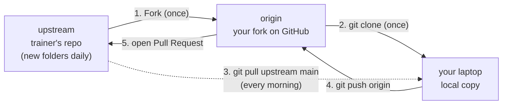

# 🐙 Git & GitHub — your daily workflow

You'll use Git **every single day** of this bootcamp, exactly like a real analytics/engineering team. This page is your reference. The first time, do the **One-time setup**. After that you only need the **Every morning** and **Submit your work** sections.

> **Key idea:** there are two copies of this repo on GitHub.
> - **`upstream`** — the trainer's official repo. New day folders appear here each morning. You can *read* it but not push to it.
> - **`origin`** — *your personal fork* of it. You push your work here, then open a Pull Request back to `upstream`.



---

## 1️⃣ One-time setup (Day 0 only)

**a. Tell Git who you are** (once per laptop):
```bash
git config --global user.name "Your Name"
git config --global user.email "you@example.com"
```

**b. Fork** the course repo: open the trainer's repo on GitHub and click **Fork** (top-right). This makes `github.com/<you>/foodco-bootcamp`.

**c. Clone *your fork* to your laptop:**
```bash
git clone https://github.com/<you>/foodco-bootcamp.git
cd foodco-bootcamp
```

**d. Add the trainer's repo as `upstream`** (so you can pull new days):
```bash
git remote add upstream https://github.com/<trainer>/foodco-bootcamp.git
git remote -v        # check: you should see origin (your fork) + upstream (trainer)
```

---

## 2️⃣ Every morning — get today's folder

```bash
git pull upstream main
```

If that's the first command of the day, it downloads the new `Day_XX` folder the trainer just released. (If nothing new appears, the trainer hasn't pushed yet — wait a minute and pull again.)

> Keep your fork tidy by also pushing the update to it: `git push origin main`.

---

## 3️⃣ Submit your work — the Pull Request

Do your work inside the day's folder (e.g. edit `answers.sql`, save your Excel file, fill a CSV). Then:

```bash
git checkout -b day07-yourname        # a branch named for the day + you
git add Day_07_SQL_Basics/            # stage just today's folder
git commit -m "Day 7: my SELECT/GROUP BY answers"
git push origin day07-yourname        # push the branch to YOUR fork
```

Then on GitHub, open your fork → click **Compare & pull request** → set the base to the **trainer's** repo `main` → **Create pull request**. That's your submission. 🎉

---

## 🧾 Cheat sheet

| I want to… | Command |
|-----------|---------|
| See what changed | `git status` |
| Get today's new folder | `git pull upstream main` |
| Stage my work | `git add <folder>/` |
| Save a snapshot | `git commit -m "message"` |
| Upload to my fork | `git push origin <branch>` |
| Start a fresh branch | `git checkout -b <name>` |
| See my remotes | `git remote -v` |

## 🆘 Common fixes
- **"Permission denied / 403 on push"** → you're pushing to `upstream` instead of `origin`. You can only push to *your fork* (`origin`).
- **"Your branch is behind"** → run `git pull upstream main` first.
- **Merge conflict** → ask the trainer; usually it means you edited a file the trainer also changed. Keep your work in *your* files (e.g. `answers.sql`) and you'll rarely hit this.
- **Committed to `main` by mistake** → that's fine for this course; just push and open the PR from `main`.
